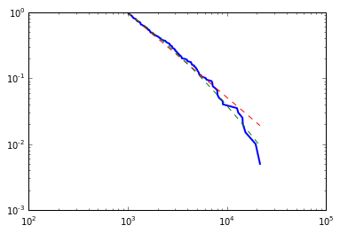
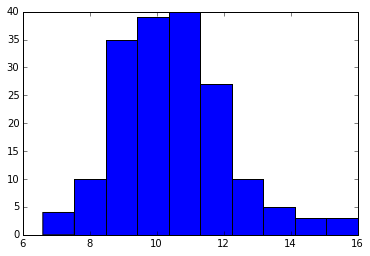

看到JohnK回答里关于一些分布细节问题的关注很感兴趣，
稍微做了一下相关检验结果发现问题很大。

JohnK答案可能完全是用Excel的函数拟合来做的，这种处理方式可能会带来一些
误导性，比如为什么没有假设检验，因为Excel这个功能并没有自带参数检验。
比如强行分组再处理，丢失了信息。比如那个“直接统计”看上去不错实际上并
不是看上去那个意思（旋转一下也许更有意义）。

我这里用Python的scipy.stats包(统计包)与powerlaw包(幂律拟合包)来直接
进行拟合和假设检验。

对于2013年GDP的幂律分布，必须搞清为什么要使用幂律分布。因为幂律分布
性质不好，所以一般如果能使用诸如指数分布/对数正态分布之类的其他长尾
分布（没有显著差别），就不应该使用幂律分布。幂律分布与它们的区别在于
它的“重尾”性而不是“长尾”性，而这一区别要在双对数坐标下才看的清楚，

双对数坐标的ccdf曲线图。
蓝色是经验分布曲线，绿色是拟合的对数正态分布曲线，红色是拟合的幂律分布曲线。
可以看出实际上实际数据更适合绿色向下扭的曲线而不是幂律分布的直线

先用ks统计量对总体进行分布估计，这个操作具体怎么执行的参见
http://arxiv.org/abs/1305.0215

再对拟合分布进行ks检验，loglikelihood值是-1.67，p值是0.22。
换句话说，幂律分布不显著__劣于__对数正态分布的拟合效果！
所以当然并没有任何理由使用幂律分布。

更有意思的一点是，如果真是对数正态分布，我们知道有个中心极限定理
告诉我们正常的独立随机变量的和趋近于正态分布，
而正独立随机变量的积则趋近于对数正态分布，
这正好可以作为一种增长率对总量生成的解释。

对于增长率的正态分布部分进行检验，先描述统计一下
注意原数据是有缺失值的，这里也没专门补上
DescribeResult(
nobs=176L, minmax=(6.5999999999999996, 16.0),
 mean=10.481818181818182, variance=2.7896103896103894,
 skewness=0.6339321887216327, kurtosis=0.7765900466693707)

看上去就像是个右偏的分布，画张图

怎么在他答案里看上去像是左偏的图。。

再用omnibus正态性检验，p值为0.0006,拒绝正态性假设。用皮尔逊III分布修正也许更佳。
